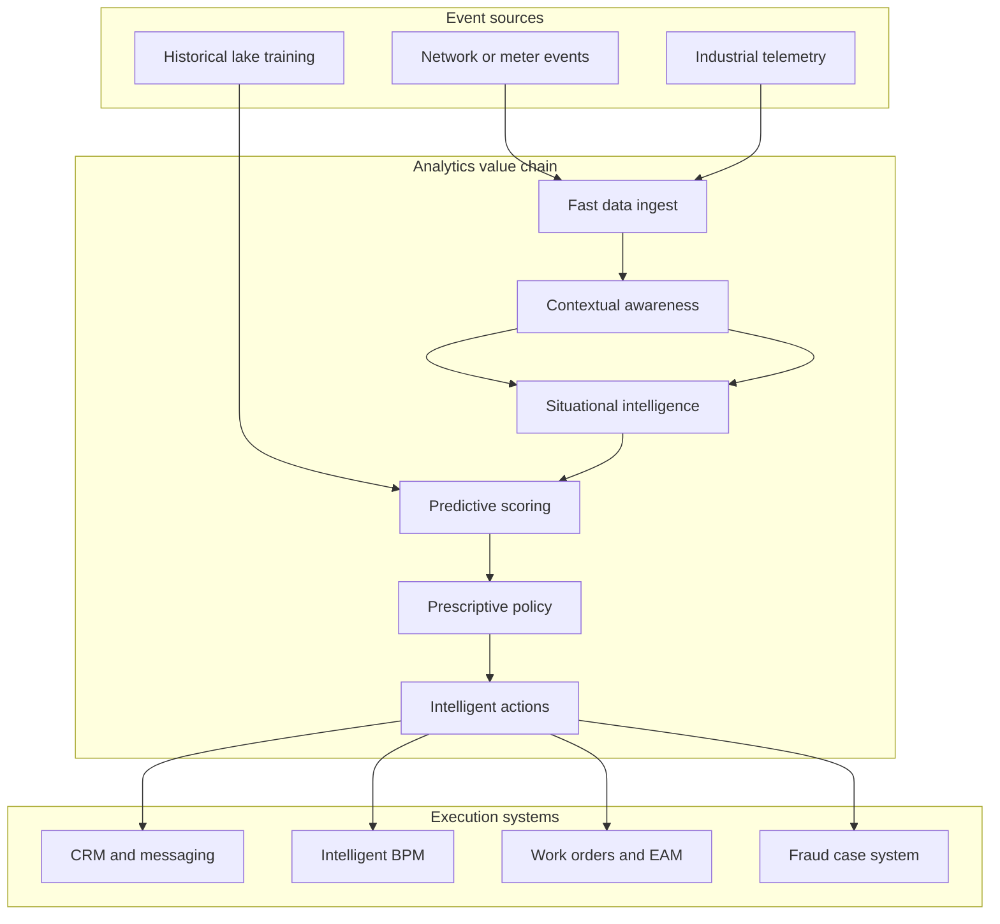

# Situara

**Source:** `ai-in-enterprise/Analytics-Value-Chain-Presentation-DaleSkeen/`
**Domain:** `ai-enterprise`
**One-liner:** A real-time analytics value-chain runtime that takes IoT and operational event streams from ingest through contextual and situational intelligence to predictive, prescriptive, and executed next-best actions before the value window closes.
**Wedge:** Utilities, telecom, and industrial operators who already have historians and data lakes but miss time-sensitive outcomes — roaming offers, storm-driven outage prevention, smart-meter fraud — because analytics still “analyzes later.”
**Positioning:** An operational intelligence product for the **analytics value chain**, not another lake. The source’s thesis is blunt: lakes are cool, streams are cooler; **timely action is the last critical mile**; IoT value (cited on the order of **$20 trillion by 2025**, with analytics as a large share) accrues when historical models are operationalised on fast data for contextual → situational → predictive → prescriptive → intelligent action loops.

## Market research synthesis

### Thesis from source

Dale Skeen (Vitria) frames IoT value potential at roughly **$20 trillion by 2025**, with analytics representing a major portion of that value (**~40%** called out on the value slide). Value pools span industrial demand/supply optimisation and asset/outage management, enterprise customer engagement and fraud/cyber, and consumer lifestyle/health use cases. The architectural argument contrasts **lakes** (ingest and store, analyze later with bulk algorithms, historical ML) against **streams** (ingest, analyze immediately with incremental algorithms, operationalise models for real-time predictions and next-best action).

The multi-stage **analytics value chain** is: Fast Data Ingestion → Contextual Awareness → Situational Intelligence → Predictive Analytics → Prescriptive Analytics → Intelligent Actions. Maturity progresses Connected → Aware → Reactive → Predictive → Proactive. Concrete patterns: a UK telco (O2) opportunity to text a roaming offer on Eurostar departures (~**10 million passengers/year**), requiring discrimination of Eurostar vs local trains and highways at cellular-event rates on the order of **~250,000 events/second**, with CRM/train-route context and ML patterns uploaded for second-scale action via rules and intelligent BPM. A utilities pattern ingests on the order of **~1,000,000 events/second** from smart meters, enriches with equipment/maintenance history and weather, predicts failures during severe weather, and triggers actions in roughly **~1 second**. Other named use cases include driver behavior scoring and smart-meter fraud (under-registration, energy-reversal events, voltage anomalies). The closing doctrine: historical + situational + predictive + prescriptive drives IoT value; **fast analytics maximises value because many IoT problems are time-sensitive**; operationalise ML from historical data into the real-time chain.

### Buyer & economic model

- **Primary buyer:** VP of Operations / Chief Digital Officer / Head of Operational Intelligence in utilities, telecom, or industrial IoT estates.
- **Users:** streaming analytics engineers, situational operators (NOC/control room), marketing ops for 1:1 offers (telco), maintenance planners, fraud analysts, model governance leads.
- **Budget owner / value metric:** outage minutes avoided, fraud loss avoided, offer conversion in the value window, truck rolls avoided — measured against latency budgets (seconds), not overnight batch SLA.
- **Competing status quo:** data lake + nightly model batch + human dashboard watching; CEP rules without predictive uplift; BPM disconnected from streaming features; “APaaS” experiments that never own the action path.

### Domain constraints

- **Regulatory / trust / safety:** grid and safety actions, customer messaging consent, fraud accusations against meters/customers require governed action authority.
- **Data sensitivity:** cellular location trajectories, smart-meter energy signatures, and driver behavior scores are highly sensitive.
- **Change-management realities:** control-room operators distrust opaque prescriptions; models trained on lakes must not silently skew vs streaming features; rules and ML must co-exist with clear precedence.

## Business requirements

- BR-1: Every production value chain must declare stage SLAs from ingest to intelligent action, with breach alerts when the value window (e.g., pre-border roaming, pre-failure dispatch) is missed.
- BR-2: Contextual enrichment (CRM, asset history, schedules, weather) must be pre-loadable and joinable to streams without falling back to overnight batch for time-critical paths.
- BR-3: Predictive models trained on historical data must be promotable to streaming inference with explicit feature-parity checks against training definitions.
- BR-4: Prescriptive outputs must resolve to authorised action types (message, work order, meter investigation, BPM case) with human or automated execution modes.
- BR-5: Situational intelligence must support disambiguation patterns (e.g., Eurostar vs local vs highway) with measurable precision targets before offers or field actions fire.
- BR-6: Throughput targets must be configurable per chain (tens of thousands to ~1M events/s class) with elastic scale policies — commercial commitment, not marketing copy.
- BR-7: Fraud and safety chains require dual control: automatic quarantine vs customer-impacting actions needing approval thresholds.
- BR-8: Operators must see explainable stage traces (what context, what situation, what prediction, what rule fired) for after-action review.
- BR-9: Maturity scoring (Connected→Proactive) must be reportable per asset class or journey type for investment planning.
- BR-10: Exception path: when feature skew or model confidence breaches limits, the chain degrades to safe reactive rules and opens a governance case — it must not invent prescriptions.
- BR-11: Consent and preference checks gate customer-facing intelligent actions (offers, alerts).
- BR-12: Value capture metrics (offer accept, outage avoided, fraud dollars) must attribute to the chain instance that acted, closing the “last critical mile” measurement loop.

## User stories

Canonical user stories live in sibling [USER_STORIES.md](USER_STORIES.md).

## System design

### Overview

Situara hosts versioned **analytics value chains**. Event streams enter ingest, are enriched with contextual stores, evaluated for situational state, scored by promoted predictive models, mapped through prescriptive policies to actions, and executed via messaging, BPM, or work-order systems — all under latency SLOs. Historical lakes remain the training ground; Situara owns operationalisation and the last-mile action path.

### Actors & boundaries

- **Actors:** ops intelligence lead, streaming engineers, control-room operators, marketing ops, fraud analysts, model governors, end customers (acted upon).
- **Trust boundary:** raw PII/location stays in governed stream stores with purpose limitation; action systems execute only authorised prescriptions. Lakes used for training do not become the operational path for time-critical decisions.
- **Human-in-the-loop points:** high-risk action approval; model promotion; safe-mode override; fraud investigation disposition.

### Core capabilities

1. **Chain definition and maturity** — stage graph and Connected→Proactive scoring.
2. **Fast ingest and rate classes** — declared throughput and backpressure policy.
3. **Contextual awareness** — preloaded joins (CRM, assets, weather, schedules).
4. **Situational intelligence** — real-time state and disambiguation.
5. **Predictive promotion** — lake-to-stream model deploy with feature parity.
6. **Prescriptive policy** — next-best action selection with precedence rules.
7. **Intelligent action execution** — message, BPM, work order, quarantine.
8. **Safe-mode and governance** — skew/confidence degradations and approvals.
9. **Value attribution** — outcomes tied to chain instances and latency compliance.

### Conceptual data

- **Primary entities:** ValueChain, ChainStage, EventRateClass, ContextualSource, SituationRule, PredictiveModel, FeatureParityCheck, PrescriptionPolicy, IntelligentAction, ActionApproval, SafeModeEvent, LatencySLO, ValueCaptureEvent, ConsentRecord, AuditTrace.
- **Critical events:** event ingested, situation matched, prediction scored, prescription selected, action executed or held, safe-mode entered, SLO breached, value captured.
- **Retention / audit needs:** action traces and approvals retained for safety/fraud lookback; high-resolution raw events retained per purpose-limited windows.

### Integrations (conceptual)

- **Systems of record:** network/OSS and smart-meter head-ends, EAM/CMMS, CRM/campaign, BPM/case, weather services, GIS/schedules.
- **Upstream signals:** cellular network events, meter telemetrics, vehicle telematics, historical lake features for training.
- **Downstream actions:** SMS/push offers, crew dispatch, meter investigation cases, fraud holds, control-room alerts.

### High-level architecture

### Success metrics

- **Leading:** % of chains meeting ingest-to-action SLO; feature-parity pass rate on promotions; safe-mode frequency; situational precision on disambiguation suites; consent-block rate on customer actions.
- **Lagging:** offer conversion inside value window; outage minutes / truck rolls avoided; fraud loss recovered or prevented; maturity advancement (Reactive→Predictive→Proactive) per asset class.

## OpenAPI skeleton

Canonical HTTP surface lives in sibling [openapi.yaml](openapi.yaml). Summary:

- **Base path:** `/v1/...`
- **Auth:** `X-API-Key` for stream producers and action systems; Bearer JWT for operators.
- **Resource groups:** Chains, Context, Situations, Models, Prescriptions, Actions, Governance.
