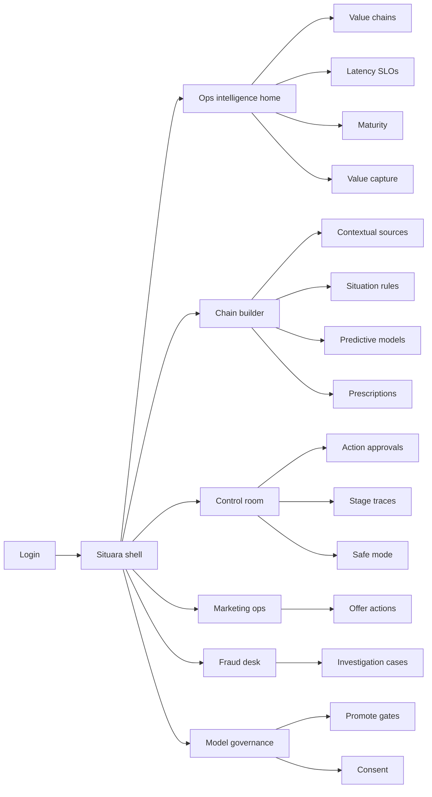
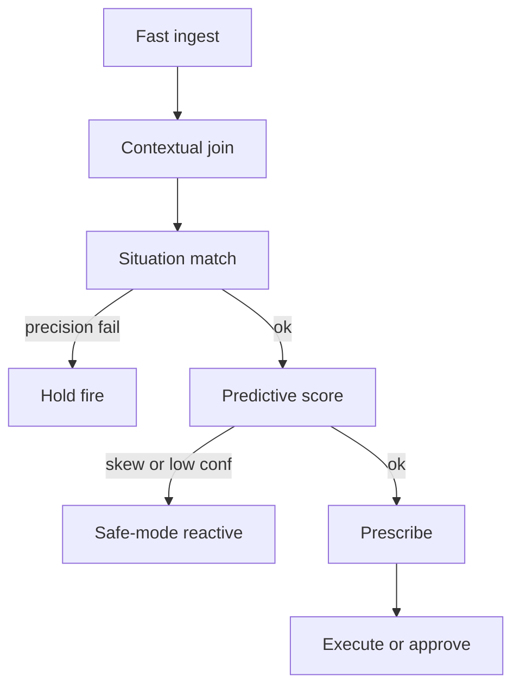

# Situara — Web app

**Product:** [PRODUCT.md](./PRODUCT.md)
**Primary surface:** Operational intelligence console (analytics value-chain runtime + control-room approvals)
**Secondary surfaces:** Streaming engineer chain builder; after-action audit trace viewer (read-only export)
**Design thesis:** Situara is a live wire from event to executed next-best action — the UI metaphor is a six-stage value chain (Ingest → Context → Situation → Predict → Prescribe → Act) racing a visible value-window clock, not a lake “analyze later” warehouse. Visual language is deep night-ops indigo with phosphor-green for SLO-healthy stages and lightning-amber for window risk; safe-mode cools the rail to steel. The brand wordmark sits on every latency board and action approval so NOC and telco ops know timely action is the product, not another batch dashboard.

## UX research synthesis

### Category peers (best-in-class)

- **Splunk ITSI / Dynatrace Davis:** Live SLO boards, stage health, and breach alerts for operational streams. Steal: ingest-to-action latency as first-class chrome; reject generic APM service maps that ignore situational disambiguation and consent-gated offers.
- **Confluent Control Center / Flink ops UIs:** Throughput classes, backpressure, and job health for high event rates. Steal: configurable rate-class commitments (tens of k to ~1M/s); reject raw topic-browser as the operator home.
- **UiPath Action Center / ServiceNow Agent Workspace:** Human approval queues for high-risk automations. Steal: customer-impacting and safety actions held above thresholds; reject RPA task aesthetics for meter fraud and grid work orders.
- **C3 AI / Aveva operations intelligence:** Asset situational views with predictive maintenance actions. Steal: weather-enriched failure prescriptions with explainable traces; reject opaque “AI score” tiles without stage provenance.

### Patterns to adopt / reject

- **Adopt:** Stage rail with live latency; value-window countdown; feature-parity gate on model promote; situation precision targets before fire; safe-mode degrade to reactive rules; consent check before customer messages; value capture attributed to chain instance.
- **Reject:** Lake job completion as success; overnight batch implied for time-critical paths; purple predictive glow; silent prescription without stage trace; spam-all geo offers without Eurostar-vs-local class disambiguation.

### Trust, density, and workflow constraints from PRODUCT.md

Location trajectories, meter signatures, and driver scores are highly sensitive — role-gate raw features; operators see stage summaries. Safety and fraud chains need dual control (BR-7). Consent gates customer actions (BR-11). Feature skew must force safe-mode, not invented prescriptions (BR-10). Density is NOC-grade on ops home; engineers get chain-builder depth; marketing ops get offer-precision views without stream internals.

## Information architecture

### Nav model

### Roles → default home

| Role | Default home | Why |
|------|--------------|-----|
| Head of operational intelligence | Ops home — SLO board + maturity | Value windows (BR-1, BR-9) |
| Streaming analytics engineer | Chain builder | Context joins, rate classes, promote (BR-2, BR-3, BR-6) |
| Control-room / NOC operator | Approvals + live prescriptions | Trust during weather events (BR-4, BR-8) |
| Telco marketing ops | Offer actions with situation confidence | Disambiguation before fire (BR-5, BR-11) |
| Fraud analyst | Investigation cases | Meter anomaly evidence (BR-7) |
| Model governor / admin | Promote gates + audit traces | Lake-to-stream safety (BR-3, BR-10) |

### Cross-links to OpenAPI resources

| Nav area | OpenAPI tags / resources |
|----------|---------------------------|
| Value chains, latency SLO | Chains |
| Contextual sources | Context |
| Situation rules | Situations |
| Predictive models, promote | Models |
| Prescription policies | Prescriptions |
| Intelligent actions, approvals | Actions |
| Safe-mode, audit traces, value capture | Governance |

## Screen inventory

### Ops intelligence home

- **Purpose:** Answer “which chains are still inside the value window?” in one composition.
- **Entry:** Ops lead post-login.
- **Layout regions:** Brand + estate filter; live SLO strip (p50/p99 ingest→act, breach count, safe-mode chains); chain stage health rail; maturity distribution; value capture today (offers, outages avoided, fraud $).
- **Primary actions:** Open breaching chain; enter safe-mode review; export shift report.
- **Empty / loading / error:** Empty = define first chain + SLO; loading = pulsing stage skeletons; error = retry with request id.
- **BR / story ties:** BR-1, BR-9, BR-12.

### Value chain list and definition

- **Purpose:** Register chains with stage graph and maturity target (Connected→Proactive).
- **Entry:** Nav → Chains.
- **Layout regions:** Table (use pattern: roaming, storm PdM, meter fraud; rate class; SLO; maturity); create wizard.
- **Primary actions:** Create; clone pattern; open builder; archive.
- **Empty / loading / error:** Empty = O2-roaming / storm-meter / fraud templates.
- **BR / story ties:** BR-1, BR-6, BR-9.

### Latency SLO board

- **Purpose:** Declare and monitor stage SLAs; alert when value window missed.
- **Entry:** Ops → SLO; chain detail.
- **Layout regions:** Per-stage budgets; live latency histogram; breach timeline; window clock for active situations.
- **Primary actions:** Edit SLO; acknowledge breach; page on-call.
- **Empty / loading / error:** No SLO = cannot go production; breach = amber/coral banner.
- **BR / story ties:** BR-1.

### Contextual sources

- **Purpose:** Preload CRM, asset history, schedules, weather joins for stream paths.
- **Entry:** Builder → Context.
- **Layout regions:** Source registry; join keys; freshness; “batch fallback forbidden” flag for critical paths.
- **Primary actions:** Register source; test join; mark critical path.
- **Empty / loading / error:** Stale context = amber; overnight-only source blocked on critical path.
- **BR / story ties:** BR-2.

### Situation rules and disambiguation

- **Purpose:** Real-time state with precision targets (e.g., Eurostar vs local vs highway).
- **Entry:** Builder → Situations; marketing precision view.
- **Layout regions:** Rule editor; disambiguation suite; precision/recall vs target; fire-enable toggle.
- **Primary actions:** Publish rule; run precision suite; disable fire until target met.
- **Empty / loading / error:** Below precision = offers/actions locked.
- **BR / story ties:** BR-5.

### Predictive model promotion

- **Purpose:** Promote lake-trained models to streaming with feature-parity checks.
- **Entry:** Builder/Gov → Models.
- **Layout regions:** Training definition vs streaming features; parity report; confidence limits; promote gate.
- **Primary actions:** Run parity; promote; rollback; open skew case.
- **Empty / loading / error:** Parity fail = block promote; skew breach → safe-mode path.
- **BR / story ties:** BR-3, BR-10.

### Prescription policies

- **Purpose:** Map predictions to authorised action types with rules/ML precedence.
- **Entry:** Builder → Prescriptions.
- **Layout regions:** Policy table (message, work order, meter investigation, BPM); precedence; risk tier; auto vs approve.
- **Primary actions:** Publish policy; set threshold; simulate.
- **Empty / loading / error:** Unauthorised action type rejected.
- **BR / story ties:** BR-4, BR-7.

### Control-room action queue

- **Purpose:** Execute or approve intelligent actions with stage explanations.
- **Entry:** NOC default.
- **Layout regions:** Live queue; selected action with stage trace (context → situation → prediction → rule); approve/reject; safe-mode badge.
- **Primary actions:** Approve; reject; force safe reactive rule; open work order.
- **Empty / loading / error:** Empty = quiet board with last event age; mobile tablet-friendly.
- **BR / story ties:** BR-4, BR-8; operator stories.
- **Mobile notes:** Large approve/reject for control-room tablets; reduce builder chrome.

### Safe-mode and governance

- **Purpose:** Degrade to reactive rules on skew/confidence breach; open governance case.
- **Entry:** Auto; Gov → Safe mode.
- **Layout regions:** Active safe-mode chains; trigger reason; reactive rule set in force; restore criteria.
- **Primary actions:** Acknowledge; restore after review; export case.
- **Empty / loading / error:** Healthy = “no safe-mode”; invent-prescription path impossible.
- **BR / story ties:** BR-10.

### Consent-gated offers (marketing ops)

- **Purpose:** Fire 1:1 actions only with consent and situation confidence.
- **Entry:** Marketing ops home.
- **Layout regions:** Offer pipeline; consent pass/fail; situation confidence; conversion in window.
- **Primary actions:** Pause offer class; inspect blocked reasons; export value capture.
- **Empty / loading / error:** Consent fail = no send; not a silent drop without count.
- **BR / story ties:** BR-11, BR-12, BR-5.

### Fraud investigation desk

- **Purpose:** Meter under-registration / reversal / voltage anomalies → evidence packs.
- **Entry:** Fraud role.
- **Layout regions:** Case queue; anomaly timeline; dual-control quarantine vs customer-impacting; disposition.
- **Primary actions:** Quarantine meter; request approval for customer action; close with evidence.
- **Empty / loading / error:** Empty = no open anomalies.
- **BR / story ties:** BR-7, BR-8.

### After-action audit traces

- **Purpose:** Exportable stage traces for regulators and internal review.
- **Entry:** Gov → Audit; action detail.
- **Layout regions:** Append-only trace; filters by chain/time; export package.
- **Primary actions:** Export; pin to incident.
- **Empty / loading / error:** Retention window notice.
- **BR / story ties:** BR-8; admin stories.

### Value capture

- **Purpose:** Attribute offer accept, outage avoided, fraud $ to the chain instance that acted.
- **Entry:** Ops → Value.
- **Layout regions:** Attribution table; latency compliance join; last-mile loop closed.
- **Primary actions:** Refresh; export board metrics.
- **Empty / loading / error:** Missing outcome feed = integration banner.
- **BR / story ties:** BR-12.

## Key flows

1. **Ingest to intelligent action** — event → context join → situation → predict → prescribe → act/approve; failure: SLO breach or safe-mode.

2. **Model promote** — lake train → feature parity → promote → streaming score; failure: parity fail blocks.

3. **Roaming offer in window** — cellular events → Eurostar disambiguation → consent → SMS; failure: local/highway → no spam.

4. **Storm preventive dispatch** — meter/weather stream → failure predict → work order prescription → operator approve → EAM.

5. **Fraud dual control** — anomaly → auto quarantine → human approval for customer-impacting → case close with evidence.

## Design system

### Tokens (CSS variables)

- `--color-ink: #E4EEF8` — text on night ground
- `--color-night-950: #070B14` — app ground
- `--color-night-900: #0E1624` — panels
- `--color-night-700: #2A3A52` — rules
- `--color-phosphor: #3DFF9A` — SLO healthy / action executed
- `--color-phosphor-dim: #1A8F55`
- `--color-lightning: #F0B429` — value-window risk / breach approaching
- `--color-coral: #FF5A4E` — SLO miss / unsafe
- `--color-steel: #7A8FA8` — safe-mode / secondary
- `--color-brand: #6EC8FF` — Situara wordmark (ops signal blue)
- `--font-display: "Sora", sans-serif`
- `--font-mono: "JetBrains Mono", monospace` — event ids, latencies, traces
- `--space-1`…`--space-8`: 4px scale
- `--radius-sm: 4px`; `--radius-md: 6px` — sharp ops console
- `--motion-pulse: 900ms ease-in-out` — live stage heartbeat
- `--motion-breach: 200ms ease-out` — SLO breach flash
- Atmosphere: subtle scanline/horizon grid on night-900; phosphor only on live health — no purple AI nebula.

### Typography & brand

- Display for SLO numerals and stage names; mono for traces, event rates, action ids.
- Brand on latency board and approvals; login: “Close the value window”; one CTA — no lake marketing collage.

### Do / don’t

- **Do:** Show stage latency always; require parity to promote; explain prescriptions; consent before messages; degrade to safe reactive rules.
- **Don’t:** Celebrate batch job green; purple predictive orbs; fire without situation precision; hide safe-mode; card grids of static IoT “value pools.”

### Accessibility & domain trust cues

- AA+ on phosphor/lightning vs night; never colour-only for breaches.
- Live regions announce SLO breaches and safe-mode entry.
- Focus: chain → situation → prescription → approval → trace.
- Audit exports machine-readable for regulators.

## Component patterns

- **ValueChainStageRail** — six-stage live health with latency chips.
- **ValueWindowClock** — countdown to missed outcome.
- **FeatureParityReport** — training vs streaming feature diff.
- **SituationPrecisionMeter** — disambiguation suite gate.
- **ActionApprovalCard** — stage-trace dual pane + risk tier.
- **SafeModeBanner** — steel cool-down of chain rail.
- **ConsentGateChip** — pass/fail before customer send.
- **ValueCaptureRow** — outcome attributed to chain instance.

## Out of scope for v1 web

- Full historical lake/SQL workbench; native mobile consumer apps; headset AR for field crews; vendor APaaS marketplace; replacing head-end/OSS systems of record; unsupervised customer messaging without consent integration.
